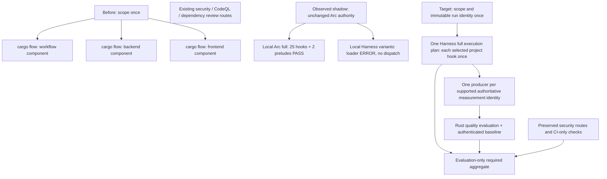

# Arc-Admin CI cost and authority topology (GH-206)

Tasks 7.2–7.4 have a reviewable inventory and conditional design. **Task 7.1 is blocked: added shadow wall-clock and runner-work cost on self-hosted CI is not measured.** No existing gate or authority changes in this issue. The [ledger](report.json) reproduces the available costs and explicitly retains unknown values as `null`. Neither this design nor the GH-205 negative corpus establishes application runtime parity.

## Measured costs and limits

| Observation | Wall/latency seconds | Runner-work seconds | Interpretation |
| --- | --- | --- | --- |
| Before: pinned [CI run 32701649122](https://github.com/musutrade/arc-admin/actions/runs/32701649122), attempt 1 | 799 execution span; 1,152 created-to-updated; 352 to first job | 1,077 | Actual self-hosted job timestamps; scope 41, workflow 285, backend 440, frontend 311 |
| Before: pinned supply-chain run 32701649091 | 157 execution span | 140 | Separate required assurance route; concurrent wall spans cannot be summed |
| Before: pinned CodeQL run 32701649194 | skipped | 0 | Event/repository condition, not evidence of a successful scan |
| GH-204 local full Arc observation | 447.239 sum of step timers | unknown | 415.231 command seconds plus 32.008 prelude seconds; not CI occupancy or total wall time |
| GH-204 Harness-Gate execution/quality variants | unknown | unknown | Both exit 1 before dispatch with `HGCFG-SHARED-SERVICE`; no elapsed-time receipt |
| Added self-hosted shadow cost | **not measured** | **not measured** | No paired self-hosted shadow run |
| Target topology | **not measured** | **not measured** | Conditional design, no savings claim |

The [before capture](../ci-capture.json) retains job/step timestamps, labels and artifact metadata. The [cost summary](../cost-summary.json) separates project commands, scope, artifact transfer, setup/teardown and residual job overhead. Job occupancy includes waits inside a job; it is not CPU time. Historical workflow timestamps have second resolution and `updated_at` is only a latency proxy. Host rates, energy, depreciation and billing allocations are unavailable; monetary cost is unknown. The predecessor CI sample has different topology and cannot be used to attribute savings.

The read-only [run-index receipt](ci-run-index.json) records the exact API request and all 17 runs returned for source `9982ed556eaf997910824d7b682946147c81a16a`. Its only `.github/workflows/ci.yml` run is the before sample. The frozen workflow contains no Harness-Gate job. This bounded query does not assert that no shadow run exists at any other revision. The [shadow receipts](../shadow/observation.json) establish local pre-dispatch failures, not self-hosted timing. Zero dispatched duplicate commands is an observed count; zero added cost would be an unsupported claim.

## Before, shadow and target

Before, the scope job routes components into three jobs, each invoking `cargo flow verify --components …`. The frontend job also owns strict doctor, npm production audit and browser provisioning. Dependency review retains its public-PR condition. Supply-chain security retains RustSec, cargo-deny, both production images, Trivy and SBOM; CodeQL retains its original conditions. These checks are outside the 25 flow hooks and cannot disappear in transfer.

Observed shadow is a local comparison, not an installed CI topology. A future full shadow run temporarily executes the selected traditional command set twice to compare engines while Arc remains authoritative. It needs an explicit finite measurement window and retained results. Harness quality collection has a single producer path even in shadow; a second copy of equivalent authoritative measurements is not justified by comparison. Engine execution-only and quality-composed diagnostic variants are not both permanent full CI lanes.

Target has a single owner of the execution plan. Start with one job and a serialized service-safe plan, preserving Arc's ordering; parallelization is conditional on demonstrated isolation and dependencies. Do not deploy the current unchanged import: HG-CAP-001 must first be resolved in task 8, without bypassing shared-service validation. A scoped CI run retains all existing scope rules and full-profile semantics for selected components; `hook` remains partial. No `ci` profile is invented. One immutable run identity binds scope, source tree, configuration, tools, artifact digests, services and selected profile. Prelude results run once for that identity, after equivalence to Arc's secret/audit contracts is proved.

## Explicit duplicate-work inventory

The [machine ledger](report.json) maps **every one of the 25 hooks** to its exact project command, cwd, profile, current owner, local execution count and single target owner. The [frozen step table](../steps.md) retains parsers, timeout overrides and services. All 25 block when selected, including the two outside the 23-entry policy list.

| Work | Before / observed shadow | Naive duplicate risk | Target treatment and proof needed |
| --- | --- | --- | --- |
| All 25 imported project hooks | One each in local Arc full; zero Harness dispatch | Adding Harness full beside all three cargo-flow component jobs repeats each selected hook once | Transfer each hook to one Harness plan only after matching source/scope/outcomes and fail-closed proof; retain the project executable |
| Secret scan and architecture audit | `verify.rs` executes each prelude independently of component filter; three CI component jobs repeat them on an all-component change | A fourth full lane repeats each again | One producer per identical tree/config/mode. Prove scope, staged/working-tree inputs and severity policy equivalent first; changed inputs are distinct work |
| Scope computation | Explicit CI scope job plus each verify resolves its scope | Separate engines repeat routing and report work | One authoritative manifest; report consumers do not rescan or silently change selection |
| npm install, Rust compilation, Playwright setup | npm ci in workflow/frontend jobs; builds in lint/test/compile, server startup and production image jobs | An extra lane repeats setup/build work | Share compatible caches/artifacts where identity permits; no assertion that different flags, instrumentation, targets or production images are equivalent |
| Frontend E2E versus full-stack smoke | Different Playwright configuration and assertions; smoke starts migration/bootstrap/backend commands | Similar browser tooling could be mistaken for duplicate assurance | Both remain project-owned gates; do not combine or remove them based on tool names |
| OpenAPI generation hook versus relationship collector | Generation consistency command exists; native contract facts are not yet provisioned | Re-exporting the same identified schema/client for both consumers | Retain command success and consume its authenticated compatible artifacts if sufficient; otherwise record the collector integration gap. Exit status is not contract evidence |
| Backend tests versus Rust coverage/CRAP | Tests run; certified Arc measurement production has not run | Collector blindly reruns the same test suite, or coverage and CRAP lanes each collect coverage | One compatible instrumented project-owned test command may supply its original result plus coverage once, only after semantics/tool/series parity. Distinct required uninstrumented assurance remains until equivalence is proved |
| Frontend tests versus line/function coverage | Native tests exist; Arc authoritative coverage not collected | Separate coverage collectors rerun tests for each metric | One compatible native coverage producer, multiple policy consumers; no fabricated Angular CRAP |
| Rust line/region/CRAP and API relationship policies | Zero authoritative producers in before and observed shadow | Independent quality lanes recollect identical series | One producer per `(source, config, target, series, tool/runtime, profile)`; fan out immutable normalized facts to policies |
| Baseline and final aggregate | Trusted Arc baseline still unprovisioned | Baseline job reruns candidate collectors; aggregate retries tests to recover a missing report | Authenticate/reuse compatible accepted baseline; aggregate only validates completeness and composes outcomes, with no tests, collectors or fallback recollection |
| RustSec and cargo-deny advisories | Overlapping domain with different configuration and broader deny checks | Treating overlap as equivalent evidence | Keep both and their original exceptions/conditions; no equivalence proof supports deletion |

No duplicate authoritative quality collection was observed: Arc's before flow has no certified generic producer, and both Harness variants stop before collection. The ledger enumerates all nine declared capabilities across three collectors; eight supported measurements have exactly one proposed producer, and frontend CRAP has zero numeric producers with an explicit unsupported diagnostic. A collector can emit several facts in one invocation. Policy evaluation and structured-result parsing reuse those facts, not rerun the producer.

## Assurance parity and transfer hold

| Obligation | Preserved target contract | Current evidence / release condition |
| --- | --- | --- |
| Traditional gates and profiles | All 25 command hooks, 23 policy entries, full/hook membership, args/cwd, timeout/env/parser semantics and any project retries | GH-202 declaration parity; GH-204 Arc PASS but Harness NOT_RUN. Require post-remediation matched runtime results for all selected blockers |
| Services and environment | Isolated PostgreSQL, inherited database-variable removal, injected test URL, health/timeout/cleanup, safe ordering | Arc service observations exist; Harness runtime proof blocked by HG-CAP-001 |
| Prelude and CI-only/security gates | Preserve secret/audit policy, doctor strictness, npm audit threshold, dependency/security/CodeQL event conditions and artifacts | Frozen source inventory; prove replacement prelude behavior and keep external security owners |
| Generic quality | Rust line/region ≥4/5, CRAP ≤30, frontend line/function ≥4/5, relationship zero breaking changes/no client drift/compatible; Angular CRAP unsupported | GH-203 accepted packs are unchanged; actual trusted Arc producers and baseline must be provisioned |
| Fail closed | Missing/failed/cancelled/timed-out required commands or evidence blocks; no skipped-to-PASS, stale baseline reset or substituted series | GH-205 six command and seventeen synthetic quality receipts; repeat real integration after remediation |
| Baseline and aggregate | Trusted merge-base lineage, debt and ratchet; one evaluator; missing/incompatible evidence blocks | ADR-0044 / ADR-0040 apply; no recollection or reduced requiredness to make aggregate green |

For each selected obligation the proposed mapping preserves a blocker and an owner, while quality adds obligations. This is an assurance-preservation argument for the design, **not proof of implemented runtime parity**. Service/prelude compatibility, trusted native producer integration and measured self-hosted cost remain prerequisites. Task 7.4 is satisfied by retaining the existing workflow and gates; no authority changes are included. Any future removal requires a separate reviewed change after tasks 8–9, accepted real parity and negatives, and the required aggregate green. Rollback restores the complete prior authority topology and authenticated compatible baseline; it must not leave two producers authoritative for the same identity or silently waive the added quality requirements.

## Finish the missing measurement

1. Resolve the task-8 loader/provisioning gaps. Freeze the same Arc SHA, imported flow/quality hashes, profile/scope, Harness SHA, runner labels/hardware, tool versions and baseline lineage for paired before/shadow trials. Do not replace the failing configuration to obtain timings in task 7.
2. Use a new directory under the current workspace and the [shadow runner](../shadow/run.py). It now retains UTC start/end, monotonic elapsed seconds and a whitelist of Actions identity for every command. A local invocation remains local. Archive extraction, binary build and other uninstrumented setup must also be accounted for by CI step/job timestamps. The timing addition is not a completed CI trial.
3. Capture self-hosted Actions run/attempt/job IDs, created/start/end timestamps, steps, logs, cache state and artifact sizes/hashes. Retain separate before and shadow execution/quality outputs, failed runs and cancelled runs. Use at least three paired repetitions for cold and warm cache conditions; report each sample and median/range separately, with queue effects explicit.
4. Compute `runner_work = sum(completed_at - started_at)` for executed jobs (including failed/cancelled work; truly skipped jobs consume zero); `execution_span = max(job end) - min(job start)`; initial wait separately. Compute added wall/work as **matched shadow minus before**. Measure target independently after implementation. Do not sum overlapping workflow spans or extrapolate GH-204 native step timers into CI savings.
5. Account for setup, scope/prelude, project commands, native collection, normalization/parsing, baseline retrieval/evaluation and artifact upload; unknown internal breakdown remains unknown. Confirm one producer per identity from execution receipts. Retain all evidence before checking 7.1 or accepting transfer.

## Validation and related records

Run `python3 docs/dogfood/arc-admin/cost/reproduce.py` to verify the ledger against hashed retained evidence. [Validation results](validation.json) record exact local checks and limits. Root `harness-gate config check` and `harness-gate verify --profile ci --all` are not applicable because this source checkout has no project-local flow/ci profile. Hosted Required Quality Aggregate remains **CI pending**, not inferred green from local checks.

Related: [OpenSpec design](../../../../openspec/changes/dogfood-harness-gate-on-arc-admin/design.md), [tasks](../../../../openspec/changes/dogfood-harness-gate-on-arc-admin/tasks.md), [GH-205 negatives](../negative/README.md), [ADR-0040](../../../adr/0040-language-agnostic-evidence-policy.md), [ADR-0044](../../../adr/0044-trusted-quality-baselines.md).
